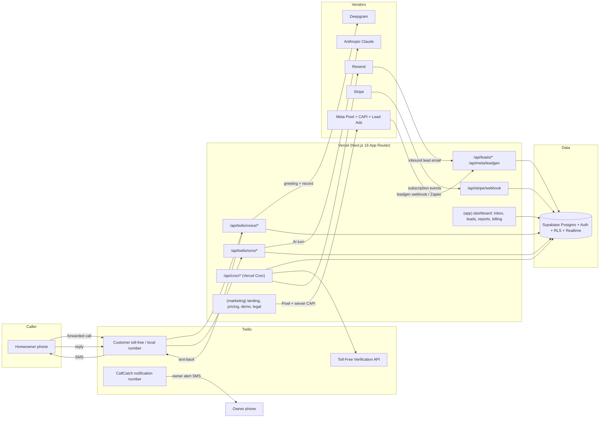

# CallCatch

**Every missed call texts back in 10 seconds.**

CallCatch is an AI text-back front desk for US residential HVAC, plumbing and electrical contractors. When the owner can't pick up, the forwarded call gets a short greeting and voicemail, the caller gets an on-brand SMS in under 10 seconds, Claude qualifies them (issue → address → urgency → preferred window → name), and the owner gets an alert with a one-tap callback and a booking-ready lead in the inbox. No number change, 10-minute setup, and a Monday "calls recovered / revenue saved" email.

Product spec: [`docs/PRODUCT_SPEC.md`](docs/PRODUCT_SPEC.md). Operator docs index: [`docs/README.md`](docs/README.md).

| | Starter | Pro |
|---|---|---|
| Monthly / annual | $79 / $790 | $149 / $1,490 |
| Conversations included | 150, then $0.25 | 500, then $0.20 |
| Numbers | 1 | 2 |
| Web-form + Meta lead reply, booking hand-off, after-hours routing | — | yes |

Optional done-for-you setup: $149 (monthly plans; waived on annual). 14-day card-required trial, or pay-now with a 30-day money-back guarantee. Source of truth for these numbers is `lib/plans.ts`.

## Architecture



Request flow that matters most: **forwarded call → `/api/twilio/voice/inbound` returns TwiML in < 1 s → `after()` schedules the text-back → caller replies → `/api/twilio/sms/inbound` → Claude turn in `after()` → `leads` row updated → owner alert from the notification number.** Postgres is the queue (`messages.status='queued'`, `messages.send_after` for quiet hours); `/api/cron/ai-followups` drains it every 5 minutes.

## Module map

| Path | Purpose |
|---|---|
| `app/(marketing)/**` | Public site: landing, `/pricing`, `/demo`, `/for/[trade]`, Terms, Privacy, SMS Terms, Refund, Data deletion |
| `app/(auth)/**` | `/login`, `/signup?plan=&interval=&path=`, Supabase Auth (email + Google), auth callback |
| `app/(app)/**` | Signed-in product: `/onboarding` wizard, `/inbox`, `/leads`, `/calls`, `/settings`, `/billing/**`, `/admin` |
| `app/api/twilio/**` | Voice inbound / recording / status, SMS inbound / status, verification status (all Twilio-signature verified) |
| `app/api/leads/**` | Resend inbound email parser, per-account JSON webhook (`X-CallCatch-Secret`) |
| `app/api/meta/**` | Lead Ads webhook (`leadgen`), internal CAPI relay (`capi`) |
| `app/api/stripe/**` | Webhook (only writer of `subscriptions` / `accounts.plan`), checkout, portal |
| `app/api/onboarding/**` | Provision number, test forwarding, submit TFV, verify alert phone |
| `app/api/demo/call` | Public demo line TwiML + demo text-back thread |
| `app/api/cron/**` | `ai-followups` (5 min), `verification-poll` (30 min), `weekly-report` (hourly), `usage-rollup` (nightly), `dunning` (daily) — `Authorization: Bearer CRON_SECRET` |
| `app/api/health` | Vendor reachability for uptime pings |
| `proxy.ts` | Next 16 proxy (formerly middleware): refreshes the Supabase session, redirects signed-out users away from app routes |
| `lib/env.ts` | Typed env access (`env.required`, `env.models()`); throws at call time, never at import time |
| `lib/db/{client,types}.ts` | Supabase clients (browser / server RLS / admin service-role) and the `Database` types |
| `lib/auth/session.ts` | `getUser`, `requireUser`, `requireAccount`, `getSessionForApi`, `isAdminEmail` |
| `lib/plans.ts` | Plan catalog, feature gates, Stripe price-id lookup, `TRIAL_DAYS`, `MONEY_BACK_DAYS` |
| `lib/telephony/{client,outbound}.ts` | Twilio client, signature validation, `sendSms`, `sendCustomerMessage` (opt-out / quiet-hours / sms_enabled guards) |
| `lib/ai/**` | Claude qualification engine: cached system prompt, strict tools, extraction, emergency template, refusal fallback |
| `lib/leads/intake.ts` | `createLeadAndEngage` shared by email / webhook / Meta intake |
| `lib/billing/{stripe,onVerified,usage}.ts` | Stripe client, verification → billing anchor / trial_end, metered overage |
| `lib/reports/weekly.ts` | Weekly stats + email renderer |
| `lib/email/send.ts` | Resend transactional sender |
| `lib/meta/{attribution,capi,pixel}.ts` | UTM/fbclid cookie, server CAPI with SHA-256 hashing + event_id dedup, browser Pixel helper |
| `lib/events.ts` | `track()` → `events` table (product analytics + CAPI source) |
| `lib/utils.ts` | `cn`, `safeEqual` (constant-time), `formatUsd`, `startOfWeekMonday`, `shortCode` |
| `components/marketing/**` | Landing-page components, Meta Pixel loader, attribution capture |
| `supabase/migrations/*.sql` | Full schema (spec §4.1), RLS, signup trigger, Realtime publication — see `supabase/README.md` |
| `supabase/seed.sql` | Demo HVAC account ("Summit Air Heating & Cooling") for screencasts and sales demos |
| `scripts/split-to-new-repo.sh` | Moves `callcatch/` out of the monorepo with history |
| `vercel.json` | Cron schedules |
| `docs/**` | Operator playbooks (deployment, runbook, compliance, sales, ads, finance, launch plan, risks) |

## Local setup

Prerequisites: Node 22, npm, a Supabase project (or the Supabase CLI for a local stack), Stripe CLI, Twilio account, ngrok (or `cloudflared`).

```bash
cd callcatch
npm install
cp .env.example .env.local        # fill in the vars below
```

1. **Database.** Hosted: `npx supabase link --project-ref <ref> && npx supabase db push`. Local: `npx supabase start && npx supabase db reset` (applies migrations + `seed.sql`). Details and the demo-account seeding steps: `supabase/README.md`.
2. **Auth.** In Supabase → Authentication → URL Configuration add `http://localhost:3000/auth/callback` to redirect URLs. Enable Email and Google providers.
3. **Stripe.** `stripe listen --forward-to localhost:3000/api/stripe/webhook` and copy the printed `whsec_…` into `STRIPE_WEBHOOK_SECRET`. Create test-mode products/prices as in `docs/DEPLOYMENT.md` §2 and paste the `price_…` ids.
4. **Twilio (dev).** `ngrok http 3000`, set `NEXT_PUBLIC_APP_URL=https://<sub>.ngrok-free.app`, and point your dev numbers' webhooks at `${NEXT_PUBLIC_APP_URL}/api/twilio/voice/inbound`, `/api/twilio/voice/status`, `/api/twilio/sms/inbound`. Signature validation is computed against `NEXT_PUBLIC_APP_URL`, so it must match the ngrok host exactly; set `TWILIO_SKIP_SIGNATURE_VALIDATION=true` only when replaying webhooks by hand.
5. **Run.** `npm run dev` → http://localhost:3000. Sign up, and the DB trigger creates your `accounts` row; `/onboarding` walks you through the rest.

## Scripts

| Command | What it does |
|---|---|
| `npm run dev` | Next dev server (Turbopack) |
| `npm run build` / `npm start` | Production build / serve |
| `npm run typecheck` | `next typegen && tsc --noEmit` |
| `npm run lint` | `eslint .` |
| `npm run check` | typecheck + lint + build (what CI runs, see `.github/workflows/ci.yml`) |
| `npx supabase db push` | Apply migrations to the linked project |
| `npx supabase gen types typescript --project-id <ref> --schema public > lib/db/types.ts` | Regenerate DB types (then re-append the convenience block, see `supabase/README.md`) |
| `python3 docs/model/model.py` | Re-run the financial model |
| `./scripts/split-to-new-repo.sh <git-url>` | Extract this folder into its own repository |

## Environment variables

Copy `.env.example` — it is the source of truth for the variable list (every variable it contains is read somewhere in `lib/` or `app/`); this table explains each one. Anything starting with `NEXT_PUBLIC_` is shipped to the browser; everything else is server-only.

| Variable | Purpose |
|---|---|
| `NEXT_PUBLIC_APP_URL` | Canonical public origin (`https://callcatch.co`); Twilio signatures and webhook URLs are built from it |
| `ADMIN_EMAILS` | Comma-separated admin logins allowed into `/admin` and escalation emails |
| `INTERNAL_API_SECRET` | Bearer for `/api/meta/capi` and other server→server calls |
| `CRON_SECRET` | Bearer Vercel Cron sends to `/api/cron/*` |
| `NEXT_PUBLIC_SUPABASE_URL` | Supabase project URL |
| `NEXT_PUBLIC_SUPABASE_ANON_KEY` | Supabase anon key (RLS applies) |
| `SUPABASE_SERVICE_ROLE_KEY` | Service-role key; server routes, webhooks, crons only |
| `STRIPE_SECRET_KEY` | Stripe secret key (`sk_live_…` in prod) |
| `STRIPE_WEBHOOK_SECRET` | Signing secret of the `/api/stripe/webhook` endpoint |
| `STRIPE_PRICE_STARTER_MONTHLY` | Price id, Starter $79/mo |
| `STRIPE_PRICE_STARTER_ANNUAL` | Price id, Starter $790/yr |
| `STRIPE_PRICE_PRO_MONTHLY` | Price id, Pro $149/mo |
| `STRIPE_PRICE_PRO_ANNUAL` | Price id, Pro $1,490/yr |
| `STRIPE_PRICE_SETUP_FEE` | One-time $149 done-for-you setup |
| `STRIPE_PRICE_OVERAGE_CONVERSATION` | Metered overage price (per conversation over plan quota) |
| `STRIPE_PRICE_OVERAGE_CONVERSATION_PRO` | Optional metered price for Pro overage ($0.20); falls back to the Starter price when unset |
| `STRIPE_CHECKOUT_REQUIRE_TOS` | `true` makes Checkout require Terms acceptance (needs a ToS URL in Stripe → Settings → Public details) |
| `TWILIO_ACCOUNT_SID` | Twilio account SID |
| `TWILIO_AUTH_TOKEN` | Twilio auth token (also validates `X-Twilio-Signature`) |
| `TWILIO_NOTIFICATION_NUMBER` | Our verified toll-free number that sends owner alerts and verification codes (E.164) |
| `TWILIO_DEMO_NUMBER` | Our verified public demo line (E.164) |
| `TWILIO_ISV_PROFILE_SID` | Trust Hub ISV Primary Business Profile (`BU…`) used when submitting customers' TFVs |
| `TWILIO_TFV_NOTIFICATION_EMAIL` | Email Twilio notifies about toll-free verification outcomes (defaults to the first `ADMIN_EMAILS` entry) |
| `TWILIO_POLICY_SOLE_PROP_CUSTOMER_PROFILE` / `TWILIO_POLICY_SOLE_PROP_TRUST_PRODUCT` | Optional overrides of the Trust Hub policy SIDs used on the sole-proprietor 10DLC path |
| `TWILIO_HANDLES_OPTOUT_KEYWORDS` | `true` (default): Twilio's carrier-standard STOP/HELP/START replies are used and the app sends none of its own for those keywords (plain-language opt-outs still get one confirmation). Set `false` only when the number sits in a Messaging Service with Advanced Opt-Out disabled |
| `TWILIO_SKIP_SIGNATURE_VALIDATION` | Dev only; `true` disables webhook signature checks. Never set in prod |
| `NEXT_PUBLIC_DEMO_NUMBER` | Demo line shown on the landing page (E.164) |
| `ANTHROPIC_API_KEY` | Claude API key |
| `CLAUDE_MODEL_CHAT` | Model id for qualification turns (default `claude-opus-5`; spec recommends `claude-sonnet-5`) |
| `CLAUDE_MODEL_FAST` | Model id for classification / extraction (default `claude-haiku-4-5`) |
| `AI_SAFE_TEMPLATE_MODE` | Ops kill switch (`true`): the AI sends only the fixed safe template instead of model replies (see `docs/RUNBOOK.md`) |
| `DEEPGRAM_API_KEY` | Voicemail transcription |
| `RESEND_API_KEY` | Transactional email |
| `RESEND_WEBHOOK_SECRET` | Svix signing secret for the inbound-email webhook |
| `RESEND_FROM_EMAIL` | From header, e.g. `CallCatch <hello@callcatch.co>` |
| `LEADS_INBOUND_DOMAIN` | Inbound lead mailbox domain (`leads.callcatch.co`) |
| `META_PIXEL_ID` | Pixel/dataset id for server CAPI |
| `NEXT_PUBLIC_META_PIXEL_ID` | Same id for the browser Pixel |
| `META_CAPI_ACCESS_TOKEN` | Conversions API system-user token |
| `META_CAPI_TEST_EVENT_CODE` | Optional; routes CAPI events to Events Manager "Test events" |
| `META_APP_ID` / `META_APP_SECRET` | Meta app for Lead Ads webhook (`X-Hub-Signature-256`) |
| `META_WEBHOOK_VERIFY_TOKEN` | `hub.verify_token` for the leadgen webhook GET challenge |
| `META_PAGE_ACCESS_TOKEN` | Long-lived Page access token of the connected Page (from the "CallCatch Lead Sync" app); required before `FEATURE_META_LEADGEN=true`, otherwise leadgen webhooks are dropped |
| `FEATURE_META_LEADGEN` | `true` once App Review passes; until then leads come via Zapier → per-account webhook |
| `NEXT_PUBLIC_SUPPORT_EMAIL` | Support address shown on the site and legal pages (default `support@callcatch.co`) |
| `NEXT_PUBLIC_PRIVACY_EMAIL` | Privacy / data-deletion request address on the legal pages (default `privacy@callcatch.co`) |
| `NEXT_PUBLIC_LEGAL_ADDRESS` | **Required in prod**: the LLC's mailing address printed in the Terms and Privacy Policy (otherwise they render "Mailing address provided on request") |
| `SENTRY_DSN` | Optional error reporting |
| `POSTHOG_KEY` | Optional product analytics |

## Deployment

Production runs on Vercel Pro + Supabase Pro. The exact order (Supabase → Stripe → Twilio → Resend → Meta → Vercel → DNS) and the post-deploy smoke test are in [`docs/DEPLOYMENT.md`](docs/DEPLOYMENT.md). On-call procedures: [`docs/RUNBOOK.md`](docs/RUNBOOK.md).

## License

Proprietary. Copyright © 2026 CallCatch LLC. All rights reserved. No part of this repository may be copied, modified, distributed or used to provide a competing service without written permission.
